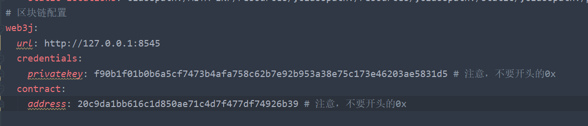

## 项目介绍

图片版存证系统基于盲水印技术以及区块链技术，**目的是给图片添加盲水印，同时将原图的哈希值存储上链，达到图片版权存证的功能**，项目采用 SpringBoot 以及Pear-Admin-Layui开发，涉及到了智能合约Solidity、打包、以及如何在Java中调用以太坊，属于区块链开发的入门级Demo.

* 项目地址：https://github.com/maohuihua123/spring-boot-picture-copyright
* 项目预览：

## 项目技术


* SpringBoot
* Web3j
* Solidity
* OpenCV
* Pear-Admin-Layui

## 项目效果图


## 快速部署

1. clone 项目到本地 `git@github.com:maohuihua123/spring-boot-picture-copyright.git`

2. 搭建以太坊私链

   方式一：安装Ganache桌面版

   ​		下载地址：https://www.trufflesuite.com/ganache

   方式二：使用docker安装

   ```yml
   version: '2'
   services:
       ganache-cli:
           image: trufflesuite/ganache-cli
           container_name: ganache-cli
           volumes:
               - ./ganache_data:/ganache_data
           ports:
               - 8545:8545
           command:
               [
                   '--gasLimit',
                   '0xfffffffffff',
               ]
                  
   ```

3. 启动以太坊私链

   在Ganache中获取以太坊账户的私钥，并填入`application.yml`中的`privatekey`

   

   私钥获取方式如下：

   

   或者（docker版本）

   

4. 在 IntelliJ IDEA 中打开 该项目，启动test目录下的测试模块，部署合约，获得合约地址

   

   

   

5. 将合约地址填入`application.yml`中的`address`

   

6. 然后启动SpringBoot项目的`MainApplication`，打开浏览器：http://localhost:8080/ 即可

   

